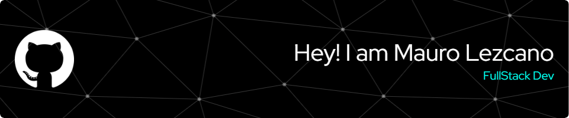

## 🗂 Acerca de mí
¡Hola! Soy Mauro Lezcano, y me complace compartir un poco sobre mí. Soy de Formosa, Argentina, donde actualmente estoy viviendo. Me considero una persona con muchas ganas de afrontar nuevos desafios y de aprender constantemente.
Actualmente me encuentro estudiando en el Instituto Privado Robustiano Macedo Martinez, la carrera de "Tecnico Superior en Desarrollo de Software".

## 🗺 Dónde Vivo
Vivo en Formosa, Argentina, y disfruto mucho de la vida en esta zona. Me encanta el futbol y programar ⚽😜.

## 🎮 Mis Gustos
Uno de mis mayores pasatiempos es programar y realizar proyectos personales. Además, tengo un gran interés en el desarrollo de videojuegos.

## 🚀 Lenguajes que Utilizo
 
  

 
 

¡Espero que esta breve presentación te haya dado una idea de quién soy y de mis intereses! Si quieres saber más, no dudes en contactarme. 🌐

